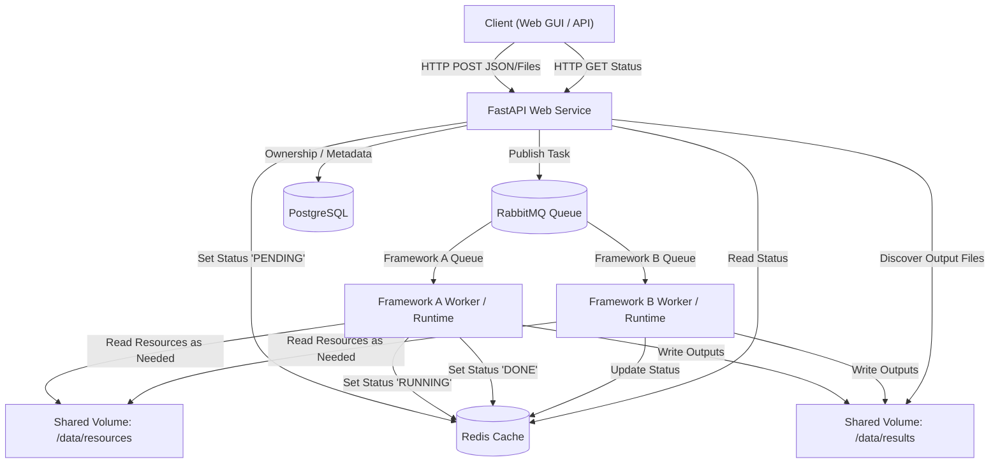
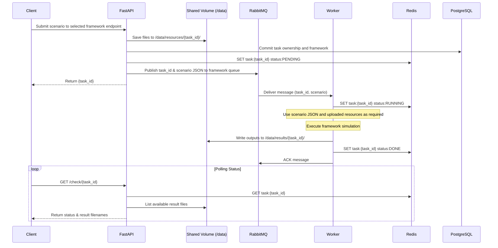

# NFDI4Energy Simulation Server

Run simulations across multiple frameworks through a shared web application.
After signing in, choose a framework to submit scenarios, inspect task status and
history, and download results.

For local setup, follow the [deployment guide](docs/deployment-guide.md).

## Frameworks

- DaceDSX
- Mosaik

## Architecture

Frameworks share the Svelte frontend, FastAPI backend, authentication, PostgreSQL
task ownership and metadata, Redis runtime status, and shared storage. RabbitMQ
routes tasks to framework-specific queues and workers. Kafka carries DaceDSX
simulation events.



## Sequence Flow

The following sequence illustrates the shared submission flow and a successful run:



## Prerequisites

- Docker, Minikube, kubectl, Git, Node.js/npm, Python 3, and OpenSSL.
- OIDC credentials are optional for local development.

## Getting Started

For local use without OIDC, create `.env` only if it does not already exist:

```bash
test -f .env || cp .env.example .env
chmod 600 .env
openssl rand -hex 32
```

Set `AUTH_DISABLED=true` in `.env`, use the generated value for `SESSION_SECRET`,
and set `DB_PASSWORD` (keep the existing password if the database already exists).
`OIDC_CLIENT_ID` and `OIDC_CLIENT_SECRET` can be left blank.

Follow the [deployment guide](docs/deployment-guide.md) for TLS certificates,
Minikube, and the data mount. Then, from the repository root:

```bash
bash build-minikube.sh
```

Keep the data mount running. After deployment, forward the shared web application:

```bash
kubectl -n simservice port-forward service/web 5001:5001
```

Open **https://localhost:5001**, sign in, and choose a framework.
In local mode, **Sign in** opens a shared development account without an external
login. Use this mode only on your own trusted machine, not a public deployment.
To use OIDC instead, set `AUTH_DISABLED=false`, supply the OIDC credentials in
`.env`, and rerun the build script.

Framework editors may need a separate port-forward. For example, to use Mosaik's
**Create scenario** action, run this in another terminal:

```bash
kubectl -n simservice port-forward service/mosaik-gui 8002:80
```

The Mosaik editor is available at **http://localhost:8002**. See the deployment
guide for framework-specific services and configuration.

Inputs are stored under `/data/resources/{task_id}/`; results are saved under
`/data/results/{task_id}/`. Keep credentials out of Git and use the stack on a
trusted local machine; do not expose the scenario editor publicly.

## License

This project is licensed under the MIT License - see the LICENSE file for details.
